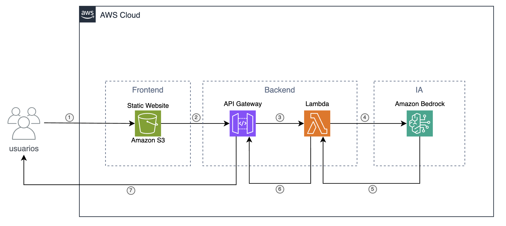

# 📄 Ask My Docs

Aplicación serverless en AWS que permite **subir un PDF en el navegador** y obtener un **resumen automático en español** utilizando **Amazon Bedrock (Claude 3 Haiku)**.  
El frontend es un sitio estático hosteado en **S3**, y el backend se implementa con **API Gateway + Lambda**.

---

## 🏗️ Arquitectura

### 🔎 Flujo explicado

1. **Users → S3**  
   El usuario abre la URL pública del bucket S3 con **Static Website Hosting**, donde se sirve el `index.html` y el JavaScript del frontend.  

2. **S3 → API Gateway**  
   El navegador, con ayuda de **pdf.js**, extrae el texto del PDF localmente y lo envía vía `POST` como JSON al endpoint `/summarize` de **API Gateway**.  

3. **API Gateway → Lambda**  
   API Gateway reenvía la solicitud a la función **Lambda `summarize`**.  

4. **Lambda → Bedrock**  
   La Lambda construye el prompt y llama a **Amazon Bedrock Runtime**, solicitando un resumen al modelo **Claude 3 Haiku**.  

5. **Bedrock → Lambda**  
   Bedrock procesa la petición y devuelve el resumen en formato JSON a la Lambda.  

6. **Lambda → API Gateway**  
   La Lambda formatea la respuesta y la devuelve a **API Gateway**.  

7. **API Gateway → Users**  
   API Gateway envía el JSON al navegador, que lo muestra en pantalla como un resumen legible.  

---

## 🖥️ Demo

➡️ [**Ver demo en S3**](http://askmydocs-website-imelinc.s3-website-us-east-1.amazonaws.com)  

---

## 📜 Tecnologías usadas
- **Amazon S3** – Hosting estático del frontend.  
- **API Gateway (HTTP API)** – Exponer endpoint `/summarize`.  
- **AWS Lambda** – Backend serverless para llamar a Bedrock.  
- **Amazon Bedrock** – Modelo Claude 3 Haiku para generar el resumen.  
- **pdf.js** – Extracción de texto desde PDF directamente en el navegador.    

---

✍️ Proyecto hecho para práctica en **AWS Free Tier** y como portfolio de **Cloud Engineer**.
